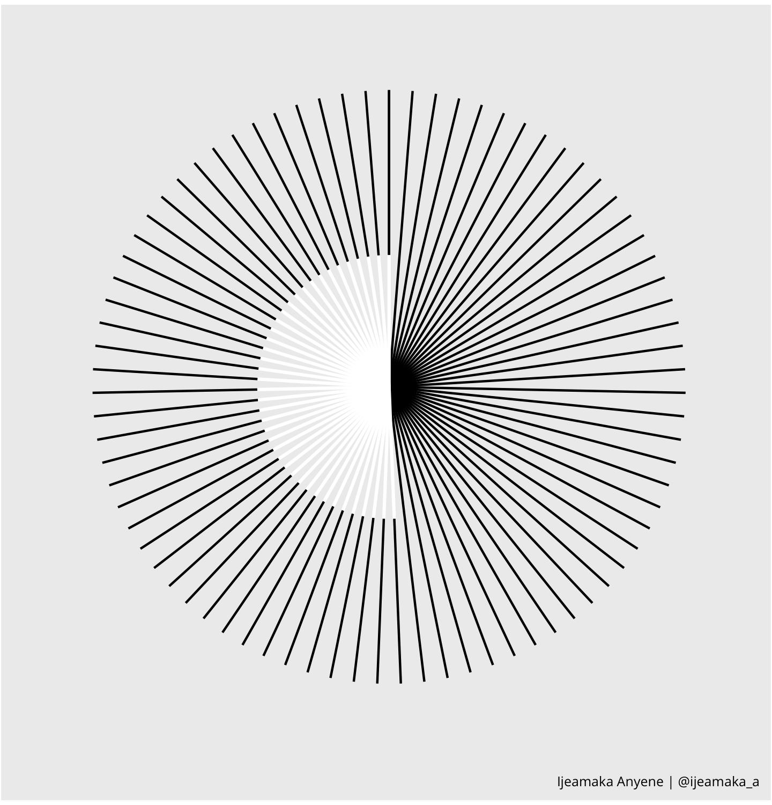

background-image: url(images/flower_cover_art_v5.png)
background-size: cover
class: left, bottom

```{r metathis, include = FALSE}
library(metathis)

meta() %>%
  meta_name("github-repo" = "Ijeamakaanyene/aRt_ggplot") %>%
  meta_social(
    title = "aRt + ggplot: exploring radial visualizations",
    description = paste0(
      "Computational art techniques can inform and spice up your data visualizations. ",
      "Presented at RLadies Johannesburg & Tunis Meetup January 14th, 2021"),
    url = "https://ijeamakaanyene.github.io/aRt_ggplot/index.html",
    image = "https://raw.githubusercontent.com/Ijeamakaanyene/aRt_ggplot/main/cover_image.png",
    image_alt = paste0(
      "Title slide of aRt + ggplot: exploring radial visualizations ",
      "Presented at RLadies Johannesburg & Tunis Meetup January 14th, 2021"),
    og_type = "website",
    og_author = "Ijeamaka Anyene",
    twitter_card_type = "summary_large_image",
    twitter_creator = "@ijeamaka_a",
    twitter_site = "@ijeamaka_a")
```

```{r, xaringanExtra-share-again, echo=FALSE}
xaringanExtra::use_share_again()
```

```{r libraries, include = FALSE}
library(ggplot2)
library(dplyr)
library(ggimage)
library(patchwork)
library(tidyr)
extrafont::loadfonts()
```

```{r, chunk-setup, include = FALSE}
knitr::opts_chunk$set(fig.retina = 3, 
                      fig.align = 'center',
                      warning = FALSE, 
                      message = FALSE)
```

```{css, echo=FALSE}
code.r.hljs.remark-code {
  position: relative;
  overflow-x: hidden;
}

code.r.hljs.remark-code:hover {
  overflow-x: visible;
  width: 500px;
  border-style: solid;
}
```

.my-white[
# aRt + ggplot: exploring radial visualizations
**Ijeamaka Anyene**  
**RLadies Johannesburg & Tunis Meetup | January 14th, 2021**
]
---
class: transition-slide-blue, center, middle
.my-green[
# computational aRt
]
--
.my-green[
# creative coding
]
--
.my-white[
### definition: model, simulate or replicate creativity using a computer
]
<br>
--
.my-white[
### ...but in #rstats
]
---
class: transition-gradient-blue, center, middle

.pull-left[
.my-white[
# Generative Art
<br>
### algorithm or rule set entered into an "autonomous system" defines the design of the art
]
]

.pull-right[
```{r, echo = FALSE, fig.align='center', out.width="90%"}

```
<br>
### Georgios Karamanis @geokaraminis
]
---
class: transition-slide-blue, center, middle

.my-white[
### An algorithm is just a well-defined set of instructions
]

---
.pull-left[
```{r, pattern-17, echo = TRUE, fig.show='hide'}
num_lines = 80

lines = tibble(
  x = 1:num_lines,
  xend = x,
  y = 1,
  yend = 10)

overlap_lines = tibble(
  x = 40:80,
  xend = x,
  y = 5,
  yend = 1)

ggplot() +
  geom_segment(data = lines, 
               aes(x = x, xend = xend,
                   y = y, yend = yend)) +
  geom_segment(data = overlap_lines, 
               aes(x = x, xend = xend,
                   y = y, yend = yend),
               color = "white",
               size = .7) +
  coord_polar()
```
]

.pull-right[
```{r, echo = FALSE, fig.align='center', out.width="80%"}

```
<br>
.center[**Pattern 17: Radial Patterns in ggplot2**]
]
---
background-image: url(images/patterns_cover_3.png)
background-size: cover
---
background-image: url(images/zine_excerpt.png)
background-size: cover
---
class: transition-slide-blue, middle

.my-green[
# Why do computational art?
]
--
.my-white[
### 1. It is fun!
]
--
.my-white[
### 2. It can be as simple or as complicated as you like.
]
--
.my-yellow[
### 3. Exploring computational art can lead to inspiration for your data visualizations.
]

---
.pull-left[
### .center[Computational Art]
```{r, echo = FALSE, fig.align='center', out.width="80%"}
knitr::include_graphics("images/pattern_3.png")
```
]

.pull-right[
### .center[TidyTuesday: Data Visualization]
```{r, echo = FALSE, fig.align='center', out.width="80%"}
knitr::include_graphics("images/2020-16_avatar.png")
```
]
--
.center[
### Both images use the same visualization techniques
]

---
.pull-left[
### .center[Pattern 1]
```{r, echo = FALSE, fig.align='center', out.width="80%"}

```
]

.pull-right[
### .center[Pattern 2]
```{r, echo = FALSE, fig.align='center', out.width="80%"}
knitr::include_graphics("images/pattern_3.png")
```
]

.center[
### Case Study: A Lesson About Segments
]

---
class: transition-slide-blue, center, middle


### .my-green[Concept 1: ] .my-white[Horizontal vs. vertical segments have different appearances in the polar coordinate system]

--
### .my-green[Concept 2: ] .my-white[Using a polar coordinate system is one of the easiest ways to make a radial-based visualization]

---
class: center, middle, transition-slide-blue

.my-white[
# My ride or die geom
]
--
.my-white[
### geom_segment()
]
.my-white[
### creates a straight line between points (x, y) and (xend, yend)
]

---
```{r, segment_tible, include=FALSE}
segment_tibble = tibble(
    x = c(0, 9.8),
    y = c(0.98, 1.02),
    text = c("x = 0 \ny = 1",
             "xend = 10 \nyend = 1"))
```

```{r, geom_segment, eval = FALSE, echo = TRUE}
ggplot() +
  geom_segment(aes(x = 0, xend = 10,
                   y = 1, yend = 1),
               size = 5)
```

```{r, plot_geom_segment, echo = FALSE, fig.align = "center", fig.width=10, fig.height=4}
ggplot() +
  geom_segment(aes(x = 0, xend = 10,
                   y = 1, yend = 1),
               size = 5) +
  geom_text(data = segment_tibble,
            aes(x = x, y = y, label = text),
            size = 5) +
  ylim(0.95, 1.05)
```

---
.pull-left[
```{r horizontal_segment}
ggplot() +
  geom_segment(aes(x = 0, xend = 10,
                   y = 1, yend = 1),
               size = 5)
```
]

.pull-right[
```{r coord_horizontal_segment}
ggplot() +
  geom_segment(aes(x = 0, xend = 10,
                   y = 1, yend = 1),
               size = 5) + 
  coord_polar() #<<
```
]

---
.pull-left[
```{r, vertical_segment}
ggplot() +
  geom_segment(aes(x = 5, xend = 5,
                   y = 1, yend = 10),
               size = 5) 
```
]

.pull-right[
```{r, coord_vertical_segment}
ggplot() +
  geom_segment(aes(x = 5, xend = 5,
                   y = 1, yend = 10),
               size = 5)  +
  coord_polar() #<<
```
]

---
class: transition-gradient-blue, middle, center

.pull-left[
.my-white[
# Computational Art: First Pattern
]
]

.pull-right[
```{r, echo = FALSE, fig.align='center', out.width="90%"}

```
]
---
.pull-left[
```{r, fig.show='hide'}
lines = tibble(
  x = seq(0, 19, by = .5),
  xend = x,
  y =  rep(0, 39),
  yend = c(rep(c(5, 10), 19), 5))

ggplot() +
  geom_segment(data = lines,
               aes(x = x, xend = xend,
                   y = y, yend = yend))
```
]

.pull-right[
```{r, echo=FALSE}
ggplot() +
  geom_segment(data = lines,
               aes(x = x, xend = xend,
                   y = y, yend = yend))
```
]

---
.pull-left[
```{r, fig.show='hide'}
dots = lines %>%
  select(x, yend)

ggplot() +
  geom_segment(data = lines,
               aes(x = x, xend = xend,
                   y = y, yend = yend)) +
  geom_point(data = dots,
             aes(x = x, y = yend))
```
]

.pull-right[
```{r, echo=FALSE}
ggplot() +
  geom_segment(data = lines,
               aes(x = x, xend = xend,
                   y = y, yend = yend)) +
  geom_point(data = dots,
             aes(x = x, y = yend))
```
]

---
.pull-left[
```{r, pattern_01, fig.show='hide'}
ggplot() +
  geom_segment(data = lines,
               aes(x = x, xend = xend,
                   y = y, yend = yend)) +
  geom_point(data = dots,
             aes(x = x, y = yend)) +
  coord_polar() #<<
```
]

.pull-right[
`)
]

---
.pull-left[
```{r, pattern_01a, fig.show='hide'}
ggplot() +
  geom_segment(data = lines,
               aes(x = x, xend = xend,
                   y = y, yend = yend)) +
  geom_point(data = dots,
             aes(x = x, y = yend)) +
  ylim(-5, 10) #+ #<<
  #coord_polar()

```
]

.pull-right[
`)
]

---
.pull-left[
```{r, pattern_02, fig.show='hide'}
ggplot() +
  geom_segment(data = lines,
               aes(x = x, xend = xend,
                   y = y, yend = yend)) +
  geom_point(data = dots,
             aes(x = x, y = yend)) +
  ylim(-5, 10) + #<<
  coord_polar()
  
```
]

.pull-right[
`)
]
---
.pull-left[
```{r, pattern_03, fig.show='hide'}
ggplot() +
  geom_segment(data = lines,
               aes(x = x, xend = xend,
                   y = y, yend = yend),
               color = "white") + #<<
  geom_point(data = dots,
             aes(x = x, y = yend),
             color = "white") + #<<
  scale_y_continuous(limits = c(-5, 10)) +
  coord_polar() +
  theme(
    plot.background = element_rect(
      fill = "#75926f"),
    panel.background = element_rect(
      fill = "#75926f"),
    panel.grid = element_blank(),
    plot.caption = element_text(
      family = "Open Sans",
      size = 6,
      color = "white"),
    axis.title = element_blank(),
    axis.text = element_blank(),
    axis.ticks = element_blank()
  )
  
```
]

.pull-right[
`)
]


---
class: transition-gradient-blue, middle, center

.pull-left[
.my-white[
# Computational Art: Second Pattern
]
]

.pull-right[
```{r, echo = FALSE, fig.align='center', out.width="90%"}
knitr::include_graphics("images/pattern_3.png")
```
]
---
.pull-left[
```{r, fig.show='hide'}
center_circle = tibble(
  x = seq(0, 19, by = .5),
  xend = x,
  y = rep(0, length(x)),
  yend = rep(3, length(x)))

ggplot() +
  geom_segment(data = center_circle,
               aes(x = x, xend = xend,
                   y = y, yend = yend))
```
]
.pull-right[
```{r, echo=FALSE}
ggplot() +
  geom_segment(data = center_circle,
               aes(x = x, xend = xend,
                   y = y, yend = yend))
```
]
---
.pull-left[
```{r, fig.show='hide'}
outer_circle = center_circle %>%
  mutate(y = yend,
         yend = yend + 6)

ggplot() +
  geom_segment(data = center_circle,
               aes(x = x, xend = xend,
                   y = y, yend = yend)) +
  geom_segment(data = outer_circle, 
               aes(x = x, xend = xend, 
                   y = y, yend = yend)) 
```
]
.pull-right[
```{r, echo=FALSE}
ggplot() +
  geom_segment(data = center_circle,
               aes(x = x, xend = xend,
                   y = y, yend = yend)) +
  geom_segment(data = outer_circle, 
               aes(x = x, xend = xend, 
                   y = y, yend = yend)) 
```
]

---
.pull-left[
```{r, comp_art_2, fig.show='hide'}
ggplot() +
  geom_segment(data = center_circle,
               aes(x = x, xend = xend,
                   y = y, yend = yend),
               size = 0.5) + #<<
  geom_segment(data = outer_circle,
               aes(x = x, xend = xend,
                   y = y, yend = yend),
               size = 2) #<< 
```
<br><br>
**Change the size of the line segments**<br>
]

.pull-right[
`)
]
---
.pull-left[
```{r, comp_art_3, fig.show='hide'}
ggplot() +
  geom_segment(data = center_circle,
               aes(x = x, xend = xend,
                   y = y, yend = yend),
               size = 0.5) + 
  geom_segment(data = outer_circle,
               aes(x = x, xend = xend,
                   y = y, yend = yend),
               size = 2) + 
  coord_polar() #<<
```
<br><br>
**Change to polar coordinate system for visualization to be a circle**
]
.pull-right[
`)
]

---
.pull-left[
```{r, comp_art_4, fig.show='hide'}
ggplot() +
  geom_segment(data = center_circle,
               aes(x = x, xend = xend,
                   y = y, yend = yend),
               size = 0.5) + 
  geom_segment(data = outer_circle,
               aes(x = x, xend = xend,
                   y = y, yend = yend),
               size = 2) + 
  #coord_polar() +
  ylim(-2, 10) #<<
```
<br><br>
**Modify `ylim()` to change the appearance of the center of the circle**

]
.pull-right[
`)
]
---
.pull-left[
```{r, comp_art_4a, fig.show='hide'}
ggplot() +
  geom_segment(data = center_circle,
               aes(x = x, xend = xend,
                   y = y, yend = yend),
               size = 0.5) + 
  geom_segment(data = outer_circle,
               aes(x = x, xend = xend,
                   y = y, yend = yend),
               size = 2) + 
  coord_polar() +
  ylim(-2, 10) #<<
```
<br><br>
**Modify `ylim()` to change the appearance of the center of the circle**

]
.pull-right[
`)
]
---
.pull-left[
```{r, comp_art_6, fig.show='hide'}
ggplot() +
  geom_segment(data = center_circle,
               aes(x = x, xend = xend,
                   y = y, yend = yend),
               size = 0.5,
               color = "white") + #<<
  geom_segment(data = outer_circle,
               aes(x = x, xend = xend,
                   y = y, yend = yend),
               size = 2,
               color = "white") + #<<
  ylim(-2, 10) + 
  coord_polar() +
  theme(
    plot.background = element_rect( #<<
      fill = "#8a484a"), #<<
    panel.background = element_rect( #<<
      fill = "#8a484a"), #<<
    panel.grid = element_blank(), #<<
    axis.title = element_blank(),#<< 
    axis.text = element_blank(),#<<
    axis.ticks = element_blank()#<<
  )
```
]
.pull-right[
`)
]
---
class: transition-gradient-blue, middle, center

.pull-left[
.my-white[
# What tricks have we covered?
]
]

.pull-right[
### 1. How to have the line segment seem to end in another geom
### 2. How to have the line segment "change" appearance
### 3. coord_polar() is a magical coordinate system 


]

---
class: transition-gradient-blue, middle

.pull-left[
.my-white[
# Create the TidyTuesday Visualization
]
]

.pull-right[
```{r, echo = FALSE, fig.align='center', out.width="90%"}
knitr::include_graphics("images/2020-16_avatar.png")
```
]
---
# TidyTuesday 2020: Week 3 Avatar!

```{r, include = FALSE}
avatar = readr::read_csv('https://raw.githubusercontent.com/rfordatascience/tidytuesday/master/data/2020/2020-08-11/avatar.csv')
```

```{r, echo = FALSE}
avatar %>%
  select(id, book, book_num, chapter, chapter_num, character) %>%
  head() %>%
  kableExtra::kable(format = "html")
```
---

```{r, echo = FALSE}
avatar %>%
  select(character, full_text) %>%
  head(n = 2) %>%
  kableExtra::kable(format = "html")
```

---
class: center, middle

```{r, echo = FALSE, fig.align="center", out.width="40%"}

```
### Who mentioned Appa and how many times per episode?

---
```{r, include= FALSE}
img = c(here::here("images", "avatar", 
                   "earth_element.png"),
        here::here("images", "avatar", 
                   "fire_element.png"),
        here::here("images", "avatar", 
                   "water_element.png"))
```

```{r, include = FALSE}
book_chapter = avatar %>%
  select(book_num, chapter_num) %>%
  unique() %>%
  mutate(chapter_seq = 
           1:length(chapter_num), 
         mention_max = 
           rep(15, length(chapter_num)),
         images = if_else(book_num == 1, 
                          img[3],
                          if_else(book_num == 2, 
                          img[1],
                          if_else(book_num == 3, 
                          img[2], "None"))))
```

```{r, include = FALSE}
appa_data = avatar %>%
  mutate(appa_mentions = stringr::str_count(full_text,
                                            "Appa")) %>%
  group_by(book_num, chapter_num, character) %>%
  summarise(appa_mentions_sum = sum(appa_mentions, na.rm = TRUE)) %>%
  filter(character != "Scene Description") %>%
  group_by(book_num, chapter_num) %>%
  top_n(n = 1, wt = appa_mentions_sum) %>%
  filter(appa_mentions_sum > 0)
```

```{r, include = FALSE}
appa_data_merged = 
  left_join(book_chapter, appa_data,
                             by = c("book_num" = "book_num",
                                    "chapter_num" = "chapter_num")) %>%
  mutate(appa_mentions_sum = replace_na(appa_mentions_sum, 0),
         character = replace_na(character, "None"), 
         duplicate_episode = duplicated(chapter_seq))
```

```{r, include = FALSE}
number_of_bar = nrow(appa_data_merged)
id = seq(1:number_of_bar)
angle = 90 - 360 * (id) / number_of_bar

appa_data_merged$angle = ifelse(angle < -90, angle+180, angle)
```

```{r, include = FALSE}
appa_data_merged$character[2] = "Aang & Katara"
appa_data_merged$character[13] = "Aang & Sokka"
appa_data_merged$character[35] = "Katara & Sokka"
appa_data_merged$character[55] = "Aang & Zuko"
appa_data_merged$character[59] = "Katara & Zuko"
appa_data_merged$character[65] = "Katara & Zuko"

appa_data_merged = appa_data_merged %>%
  filter(duplicate_episode == FALSE)
```

.pull-left[
### Visualization Aims
### 1. We want a spoke-type radial visualization.
### 2. Each episode/chapter is a line segment.
### 3. Length of the line segment is the number of mentions of Appa per chapter.
### 4. The line segment should have two different appearances
]

.pull-right[
<br><br>
```{r, echo = FALSE, fig.align='center'}
appa_data_merged %>%
  select(-c(chapter_num, images, duplicate_episode, angle)) %>%
  head(n = 6) %>%
  kableExtra::kable(format = "html", ) %>%
  kableExtra::kable_styling(full_width = F, font_size = 15)
```
]

---
.pull-left[
```{r appa_plot_1, fig.show='hide'}
ggplot(data = appa_data_merged) +
  geom_segment(aes(x = chapter_seq,
                   xend = chapter_seq,
                   y = 0,
                   yend = appa_mentions_sum))
```
<br><br>
**Add line segments for each chapter and number of Appa mentions**

]


.pull-right[
`)
]
---
.pull-left[
```{r appa_plot_2, fig.show='hide'}
ggplot(data = appa_data_merged) +
  geom_segment(aes(x = chapter_seq,
                   xend = chapter_seq,
                   y = 0,
                   yend = appa_mentions_sum)) +
  geom_segment(aes(x = chapter_seq, #<<
                   xend = chapter_seq, #<<
                   y = appa_mentions_sum, #<<
                   yend = mention_max), #<<
               linetype = "dotted") #<<
```
<br><br>
**Add dashed lines to make all segments equal in height**

]

.pull-right[
`)
]
---
.pull-left[
```{r appa_plot_4, fig.show='hide'}
ggplot(data = appa_data_merged) +
  geom_segment(aes(x = chapter_seq,
                   xend = chapter_seq,
                   y = 0,
                   yend = appa_mentions_sum)) +
  geom_segment(aes(x = chapter_seq, 
                   xend = chapter_seq, 
                   y = appa_mentions_sum, 
                   yend = mention_max), 
               linetype = "dotted") +
  geom_image(aes(x = chapter_seq, #<<
                 y = mention_max + 2, #<<
                 image = images), #<<
             size = 0.03) #<<
```
<br><br>
**Adding image to indicate book type**  
]

.pull-right[
`)
]
---
.pull-left[
```{r appa_plot_5, fig.show='hide'}
ggplot(data = appa_data_merged) +
  geom_segment(aes(x = chapter_seq,
                   xend = chapter_seq,
                   y = 0,
                   yend = appa_mentions_sum)) +
  geom_segment(aes(x = chapter_seq, 
                   xend = chapter_seq, 
                   y = appa_mentions_sum, 
                   yend = mention_max), 
               linetype = "dotted") +
  geom_image(aes(x = chapter_seq, 
                 y = mention_max + 2,
                 image = images), 
             size = 0.03) +
    coord_polar() #<<
```
<br><br>
**Changing to polar coordinate system**  
  
Do you notice that the icons overlap at the top of the circle?
]

.pull-right[
`)
]
---
.pull-left[
```{r appa_plot_6, fig.show='hide'}
ggplot(data = appa_data_merged) +
  geom_segment(aes(x = chapter_seq,
                   xend = chapter_seq,
                   y = 0,
                   yend = appa_mentions_sum)) +
  geom_segment(aes(x = chapter_seq, 
                   xend = chapter_seq, 
                   y = appa_mentions_sum, 
                   yend = mention_max), 
               linetype = "dotted") +
  geom_image(aes(x = chapter_seq, 
                 y = mention_max + 2,
                 image = images), 
             size = 0.03) +
    coord_polar() + 
    xlim(0, 61) #<<
```
<br><br>
**Expanding x-axis to remove overlap**  
  
We want to have a distinct inner circle similarly to the computational art piece.
]

.pull-right[
`)
]
---
.pull-left[
```{r appa_plot_7, fig.show='hide'}
ggplot(data = appa_data_merged) +
  geom_segment(aes(x = chapter_seq,
                   xend = chapter_seq,
                   y = 0,
                   yend = appa_mentions_sum)) +
  geom_segment(aes(x = chapter_seq, 
                   xend = chapter_seq, 
                   y = appa_mentions_sum, 
                   yend = mention_max), 
               linetype = "dotted")  +
  geom_image(aes(x = chapter_seq, 
                 y = mention_max + 2,
                 image = images), 
             size = 0.03) +
    coord_polar() + 
    xlim(0, 61) +
    ylim(-15,35) #<<
```
<br><br>
**Expand y-axis to have center circle**
]

.pull-right[
`)
]

---
.pull-left[
```{r appa_plot_8, fig.show='hide'}
ggplot(data = appa_data_merged) +
  geom_segment(aes(x = chapter_seq,
                   xend = chapter_seq,
                   y = 0,
                   yend = appa_mentions_sum)) +
  geom_segment(aes(x = chapter_seq, 
                   xend = chapter_seq, 
                   y = appa_mentions_sum, 
                   yend = mention_max), 
               linetype = "dotted") +
  geom_image(aes(x = chapter_seq, 
                 y = mention_max + 2,
                 image = images), 
             size = 0.03) + 
  geom_segment(aes(x = 0, #<<
                   xend = 61, #<<
                   y = 0, #<<
                   yend = 0)) + #<< 
  # coord_polar() + 
  xlim(0, 61) +
  ylim(-15,35)
```
<br><br>
**Add a horizontal segment**

]

.pull-right[
`)
]
---
.pull-left[
```{r appa_plot_9, fig.show='hide'}
ggplot(data = appa_data_merged) +
  geom_segment(aes(x = chapter_seq,
                   xend = chapter_seq,
                   y = 0,
                   yend = appa_mentions_sum)) +
  geom_segment(aes(x = chapter_seq, 
                   xend = chapter_seq, 
                   y = appa_mentions_sum, 
                   yend = mention_max), 
               linetype = "dotted") +
  geom_image(aes(x = chapter_seq, 
                 y = mention_max + 2,
                 image = images), 
             size = 0.03) + 
  geom_segment(aes(x = 0, #<<
                   xend = 61, #<<
                   y = 0, #<<
                   yend = 0)) + #<< 
  coord_polar() + 
  xlim(0, 61) +
  ylim(-15,35)
```
<br><br>
**Now have a "path" inner circle**

]

.pull-right[
`)
]
---
```{r, include = FALSE}
appa_img = c(here::here("images", "avatar", "appa.png"))
```

.pull-left[
```{r appa_plot_10, fig.show='hide'}
ggplot(data = appa_data_merged) +
  geom_segment(aes(x = chapter_seq,
                   xend = chapter_seq,
                   y = 0,
                   yend = appa_mentions_sum)) +
  geom_segment(aes(x = chapter_seq, 
                   xend = chapter_seq, 
                   y = appa_mentions_sum, 
                   yend = mention_max), 
               linetype = "dotted") +
  geom_image(aes(x = chapter_seq, 
                 y = mention_max + 2,
                 image = images), 
             size = 0.03) + 
  geom_segment(aes(x = 0, 
                   xend = 61, 
                   y = 0, 
                   yend = 0)) + 
  geom_image(aes(x = 30, #<<
                 y = -15, #<<
                 image = appa_img), #<<
             size = .25) + #<<
  #coord_polar() + 
  xlim(0, 61) +
  ylim(-15,35)

```
<br>
**Add an Appa image to center of visualization**
]

.pull-right[
`)
]
---
.pull-left[
```{r appa_plot_10a, fig.show='hide'}
ggplot(data = appa_data_merged) +
  geom_segment(aes(x = chapter_seq,
                   xend = chapter_seq,
                   y = 0,
                   yend = appa_mentions_sum)) +
  geom_segment(aes(x = chapter_seq, 
                   xend = chapter_seq, 
                   y = appa_mentions_sum, 
                   yend = mention_max), 
               linetype = "dotted") +
  geom_image(aes(x = chapter_seq, 
                 y = mention_max + 2,
                 image = images), 
             size = 0.03) + 
  geom_segment(aes(x = 0, 
                   xend = 61, 
                   y = 0, 
                   yend = 0)) + 
  geom_image(aes(x = 30, #<<
                 y = -15, #<<
                 image = appa_img), #<<
             size = .25) + #<<
  coord_polar() + #<<
  xlim(0, 61) +
  ylim(-15,35)

```
<br>
**Add an Appa image to center of visualization**
]

.pull-right[
`)
]
---
```{r, include = FALSE}
appa_plot = ggplot(data = appa_data_merged) +
  geom_segment(aes(x = chapter_seq,
                   xend = chapter_seq,
                   y = 0,
                   yend = appa_mentions_sum)) +
  geom_segment(aes(x = chapter_seq, 
                   xend = chapter_seq, 
                   y = appa_mentions_sum, 
                   yend = mention_max), 
               linetype = "dotted") +
  geom_image(aes(x = chapter_seq, 
                 y = mention_max + 2,
                 image = images), 
             size = 0.03) + 
  geom_segment(aes(x = 0, 
                   xend = 61, 
                   y = 0, 
                   yend = 0)) + 
  geom_image(aes(x = 30, 
                 y = -15, 
                 image = appa_img), 
             size = .25)
```


.pull-left[
```{r appa_plot_11, fig.show='hide'}
appa_plot +
  geom_text(aes(x = chapter_seq, #<<
                y = 31, #<<
                label = paste0(character, " ", #<<
                               book_num, ".", #<<
                               chapter_num), #<<
                angle = angle), #<<
            size = 3.5) + #<<
  coord_polar() + 
  xlim(0, 61) +
  ylim(-15,35)
```
<br><br>
**Add character, book, and chapter number label**  
]

.pull-right[
`)
]
---
.pull-left[
```{r appa_plot_aes1, fig.show='hide'}
appa_plot + 
  geom_text(aes(x = chapter_seq, 
                y = 31, 
                label = paste0(character, " ", 
                               book_num, ".", 
                               chapter_num), 
                angle = angle), 
            size = 3.5) + 
  coord_polar() + 
  xlim(0, 61) +
  ylim(-15,35) +
  theme(text = element_text( #<<
        family = "Lora"), #<<
        panel.background = element_rect( #<<
          fill = "#e1d2c0"), #<<
        plot.background = element_rect( #<<
          fill = "#e1d2c0", #<<
          colour = "#0f0d0d", #<<
          size = 4), #<<
        panel.grid = element_blank(), #<<
        axis.text = element_blank(), #<<
        axis.title = element_blank(), #<<
        axis.ticks = element_blank())  #<<

```
]

.pull-right[
`)
]
---
class: transition-slide-blue, middle


.my-white[
# Let's revisit the visualizations
]

---
.pull-left[
```{r, echo=FALSE}
ggplot() +
  geom_segment(data = lines,
               aes(x = x, xend = xend,
                   y = y, yend = yend)) + 
  geom_point(data = dots,
             aes(x = x, y = yend)) + 
  ylim(-5, 10)
```
.center[
### Computational Art: First Pattern
]
]

.pull-right[
```{r echo=FALSE}
ggplot(data = appa_data_merged) +
  geom_segment(aes(x = chapter_seq,
                   xend = chapter_seq,
                   y = 0,
                   yend = appa_mentions_sum)) +
  geom_segment(aes(x = chapter_seq, 
                   xend = chapter_seq, 
                   y = appa_mentions_sum, 
                   yend = mention_max), 
               linetype = "dotted") + 
  geom_image(aes(x = chapter_seq,
                 y = mention_max + 2, 
                 image = images), 
             size = 0.03) +
  geom_segment(aes(x = 0, 
                   xend = 61, 
                   y = 0, 
                   yend = 0)) +
  xlim(0, 61) +
  ylim(-15,35)
```
.center[
### TidyTuesday: DataViz
]
]
---
.pull-left[
```{r, echo = FALSE}
ggplot() +
  geom_segment(data = center_circle,
               aes(x = x, xend = xend,
                   y = y, yend = yend),
               size = 0.5) + 
  geom_segment(data = outer_circle,
               aes(x = x, xend = xend,
                   y = y, yend = yend),
               size = 2) + 
  ylim(-2, 10) 
```
.center[
### Computational Art: Second Pattern
]
]

.pull-right[
```{r echo=FALSE}
ggplot(data = appa_data_merged) +
  geom_segment(aes(x = chapter_seq,
                   xend = chapter_seq,
                   y = 0,
                   yend = appa_mentions_sum)) +
  geom_segment(aes(x = chapter_seq, 
                   xend = chapter_seq, 
                   y = appa_mentions_sum, 
                   yend = mention_max), 
               linetype = "dotted") + 
  geom_image(aes(x = chapter_seq,
                 y = mention_max + 2, 
                 image = images), 
             size = 0.03) +
  geom_segment(aes(x = 0, 
                   xend = 61, 
                   y = 0, 
                   yend = 0)) +
  xlim(0, 61) +
  ylim(-15,35)
```
.center[
### TidyTuesday: DataViz
]
]

---
class: center, middle, transition-slide-blue

.my-white[
### You can do computational art! If not for fun, then to improve your data visualization skills!
]


---
class: center, middle, transition-gradient-blue

.pull-left[
.my-white[
# Waffles says thank you for attending!
<br>

### twitter: @ijeamaka_a
### github: ijeamakaa/aRt_ggplot_slides
]
]


.pull-right[
```{r, echo = FALSE, fig.align='center', out.width="70%"}

```
]

